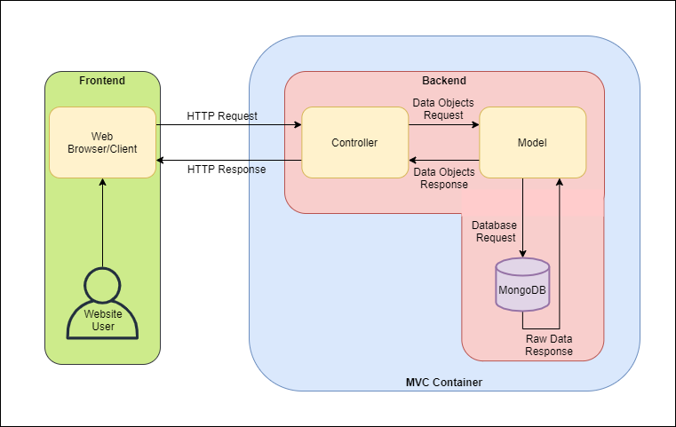

# **E-BOOK: Arquitetura Geral do Projeto**

## Descrição

Este documento tem como objetivo apresentar a arquitetura geral do projeto E-Book, que consiste em um sistema de compra e venda de livros online. Nesta seção, será apresentado o histórico de revisões, onde todas as modificações neste projeto serão registradas. Em seguida, a visão geral, que aborda de forma sucinta a arquitetura geral do projeto. Após isso, serão apresentados os requisitos não funcionais, isto é, os requisitos relacionados ao uso da aplicação em termos de desempenho, usabilidade, confiabilidade, dentre outros. Além disso, seções serão dedicadas para mecanismos arquiteturais e suas tecnologias, decisões de design, validação com casos de teste, componentes e implantação da arquitetura.

## Histórico de revisões

| **Data** | **Versão** | **Descrição** | **Autor** |
| --- | --- | --- | --- |
| 05/07/2020 | 1.0 | Adição da Visão Geral | Guilherme Felipe de Oliveira Medeiros |

## Visão Geral

A linguagem de programação que será utilizada para desenvolver o sistema **E-Book** será JavaScript, vale salientar que serão utilizadas suas bibliotecas redux.js e react.js para o frontend, além de nodejs como runtime para utilização de js no backend.

A arquitetura básica a ser utilizada no sistema será o MVC, que é o acrônimo de Model-View-Controller, ou, em português, Modelo-Visualização-Controle. Esse padrão de arquitetura divide a aplicação em camadas, o que favorece, dentre outras coisas, a manutenção do software.

As três camadas da arquitetura do projeto são apresentação, camada de modelo e camada de controle. A apresentação (view) é o espaço onde ocorre a interação com o usuário, incluindo a visualização do sistema. Já o modelo (model), é onde as informações de entrada e saída são tratadas, possuindo conexão com o banco de dados. Por fim, o controle (controller) é responsável pelo tratamento das requisições vindas a partir da camada de visualização.

O funcionamento da aplicação ocorre como demonstrado na figura 1: o usuário acessa o seu web browser (navegador de internet) e realiza uma requisição HTTP ao controller, que, por sua vez, requisita ao model os objetos de dados. Os dados são buscados no banco de dados que, neste caso, é o MongoDB. Em seguida, o banco de dados entrega os dados brutos ao modelo, que os trata e remete ao controller. Após isso, este último retorna os dados solicitados em uma resposta HTTP, que é codificada no navegador do usuário.

A visualização, implícita na figura 1, está contida no frontend, mais especificamente, no web browser/client, pois é nessa parte onde toda a interação com o usuário ocorre, desde as ações mais simples como um clique na tela, até o recebimento de dados requisitados pelo usuário. O backend inclui o controller, model e o banco de dados.

Figura 1. Imagem que representa a visão geral no documento. Fonte: próprios autores

## Requisitos Não Funcionais

| **Requisito não funcional** | **Descrição** |
| --- | --- |
| Usabilidade | O usuário deve conseguir utilizar o sistema em qualquer largura de device com uma boa experiência |
| Segurança | O sistema deve ter segurança de rotas , controle de permissões e autenticação |
| Desempenho | O sistema deve conseguir receber várias requisições e tratar elas sem perda de desempenho |

## **Mecanismos arquiteturais**

Nesta fase do documento, devemos listar os mecanismos arquiteturais encontrados no sistema, ou seja, identificar todos os mecanismos de análise, mecanismo de design e mecanismo de implementação. O intuito desta etapa é verificar e garantir que todas as preocupações técnicas relativas à arquitetura do sistema tenham sido capturadas.

Exemplo:

| Mecanismo de Análise | Mecanismo de Design | Mecanismo de Implementação |
| --- | --- | --- |
| Persistência | Banco de dados não relacional | MongoDB |
| Back-end | Application Programming Interface | Nodejs (Express) |
| Front-End | Interface de comunicação com o usuário do portal. | HTML, CSS, JS, React, Redux |
| Tratamento de exceções | Camada para tratar as exceções criando interações diferentes para usuários e técnicos. | Express (nodejs) |
| Build | Programação da IDE para validação do código fonte. | Visual Studio Team System Foundation Server. |
| Deploy | Configuração da IDE de deploy. | Visual Studio Team System Foundation Server. |

## Tecnologias

React - Biblioteca utilizada para criação de UI por meio de componentização

Redux - Biblioteca utilizada para gerenciamento de estado global em uma aplicação

React-router-dom - Biblioteca utilizada para gerenciamento de rotas em SPA's criadas em react.

Nodejs - Runtime que roda JS no backend baseado na engine V8 do chrome

Express- Framework para tratamento de requisições http em nodejs

MongoDB - Banco de dados não relacional

## Decisões de Design

Neste projeto utilizamos o padrão REST de api pois estávamos querendo separar as preocupações de o que é frontend e backend, pois queríamos criar um front-end de SPA onde o frontend faria as requisições http e o backend apenas trataria tais requisições e retornaria apenas os dados requisitados, fazendo assim com que o backend se preocupasse apenas com tratamento de dados e o frontend apenas com apresentação de dados.

Não houve necessidade de micro-serviços pois é um projeto simples e seria muito over engineering, fazendo com que o projeto se tornasse muito mais complexa do que ele precisa ser.

Decidimos utilizar MongoDB pois é um banco de dados não relacional , que dá abertura para utilização de estruturas complexas dentro do BD, tais como : Array e Objetos, essas estruturas abrem uma nova forma de pensamento, tais como embedded documentos, sem falar que mongoDB tem uma ótima performance.

A utilização de utilizar nodejs no backend foi feita para facilitar o desenvolvimento de frontend e backend com a mesma linguagem, sem falar que a linguagem é ótima para tarefas com delivery contínuo, que é um dos pontos principais de uma REST API

A decisão de utilizar react no frontend foi feita para facilitar a criação do layout, pois react possibilita fazer a criação do layout por componentização, fazendo com que seja possível fazer a reutilização de tais componentes, tornando assim o desenvolvimento mais fácil e mais rápido.

# Validação com Casos de Teste

Nesta fase selecionar User Stories com cenários escolhidos para a validação da arquitetura apresentada. Casos de uso, backlog, requisitos de usuários ou qualquer outro nome que represente os itens relevantes para o funcionamento do sistema final, o intuito é exercitar e testar os principais aspectos de risco da arquitetura.

Exemplo:

| User Story | Descrição dos testes |
|:-:|-|
| US 01 | - Cadastrar um livro e ver se aparece no “listar livros”. - Excluir um livro e checar se foi excluído. - Alterar os campos de um livro e checar se os campos alterados foram salvos corretamente. - Checar se o usuário consegue ver os detalhes de um livro. - Checar se ao preencher um livro com apenas os campos obrigatórios, ele é salvo normalmente. |
| US 02 | - Cadastrar um cliente e checar se foi salvo / cadastrado corretamente. - Inativar um cliente e checar se foi inativado. - Alterar os campos de um cliente e checar se os campos alterados foram salvos corretamente. - Checar se os perfis de usuários são mostrados corretamente. - Checar se ao preencher um cliente com apenas os campos obrigatórios, ele é salvo normalmente. |
| US 03 | - Fazer uma compra e checar se foi feita corretamente. - Cancelar uma compra e checar se foi cancelada. - Atualizar os itens de uma compra e checar se os novos livros foram adicionados / retirados corretamente. - Checar se os dados de uma compra finalizada foram salvos corretamente. |
| US 04 | - Checar se ao preencher dados reais e corretos, se o sistema aceita o pagamento. - Checar se ao preencher dados falsos / incorretos, se o sistema nega o pagamento |
| US 05 | - Inserir um livro na lista de desejos e checar se foi salvo corretamente. - Remover um livro da lista de desejo e checar se foi removido. - Checar se a visualização dos livros pela lista de desejos está funcionando. |
| US 06 | - Inserir um comentário em um livro e checar se foi salvo corretamente. - remover um comentário de um livro e checar se foi removido. - Checar se a visualização dos comentários de um livro está funcionando. - Checar se ao editar e salvar um comentário ele é salvo corretamente. |
| US 07 | - Checar se os dados de um relatório foram todos gerados corretamente. |

# Referências

DEVMEDIA. **Introdução ao Padrão MVC**. Disponível em \&lt;[https://www.devmedia.com.br/introducao-ao-padrao-mvc/29308](https://www.devmedia.com.br/introducao-ao-padrao-mvc/29308); Acesso em: jul. de 2020

KUMAR, Saket. **MVC Design Pattern.** Disponível em \&lt;[https://www.geeksforgeeks.org/mvc-design-pattern/](https://www.geeksforgeeks.org/mvc-design-pattern/);. Acesso em: jul. de 2020.

REDUX. **Getting Started with Redux**. Disponível em \&lt;[https://redux.js.org/introduction/getting-started](https://redux.js.org/introduction/getting-started);. Acesso em jul. de 2020.
